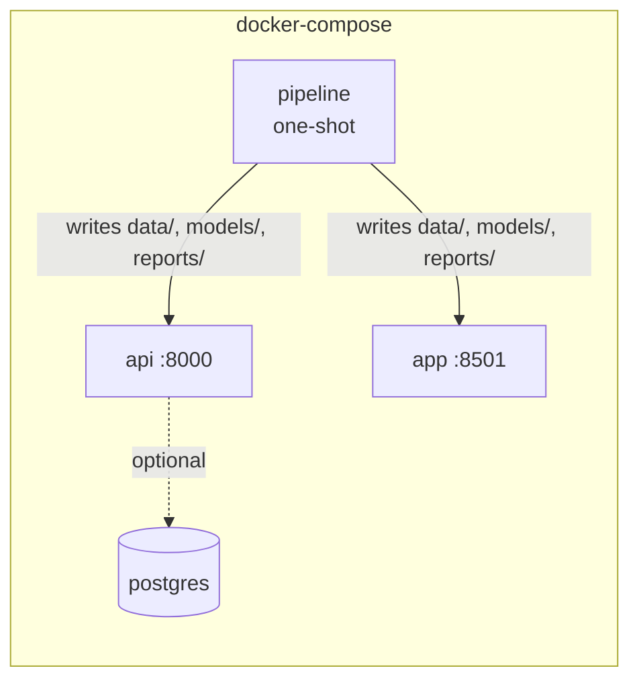

# Architecture — NovaMart Customer 360 & Revenue Intelligence Platform (CRIP)

## 1. System overview

CRIP is a batch analytics/ML pipeline feeding two consumer-facing surfaces (a REST API and a
Streamlit dashboard) plus flat-file exports for Power BI. There is no streaming/real-time
component — all scoring is computed once per pipeline run and served from the resulting files.

```mermaid
flowchart TD
    subgraph Generation
        GEN["src/data/generate_data.py<br/>synthetic NovaMart dataset"]
    end

    subgraph Pipeline["scripts/run_pipeline.py"]
        VAL["src/data/validation.py<br/>data quality checks"]
        CLEAN["src/data/data_cleaning.py"]
        FEAT["src/data/feature_engineering.py<br/>snapshot-based feature table"]
        RFM["src/analytics/rfm.py"]
        SEG["src/analytics/segmentation.py<br/>K-Means + PCA"]
        CHURN["src/models/churn_model.py<br/>LR / RF / XGBoost"]
        CLV["src/models/clv_model.py<br/>Random Forest regressor"]
        SHAP["src/models/model_explainability.py"]
        RISK["src/business/revenue_at_risk.py"]
        PROFIT["src/analytics/profitability.py"]
        NBA["src/business/next_best_action.py"]
        KPI["src/analytics/eda.py<br/>executive_kpis.json"]
        CHARTS["src/analytics/eda_charts.py"]
        EXPORT["src/business/recommendations.py<br/>Power BI export + recommendations.md"]
    end

    subgraph Storage["data/processed/*.csv, models/*.pkl, reports/*"]
    end

    subgraph Serving
        API["api/main.py (FastAPI)"]
        DASH["dashboard/app.py (Streamlit)"]
        COPILOT["ai_copilot/copilot.py"]
        PBI["powerbi/powerbi_data/*.csv"]
    end

    subgraph DB["PostgreSQL (optional, not exercised in this build's sandbox)"]
        SCHEMA["database/schema.sql"]
        VIEWS["database/views.sql"]
    end

    GEN --> VAL --> CLEAN --> FEAT --> RFM --> SEG --> CHURN --> CLV --> SHAP --> RISK --> PROFIT --> NBA --> KPI --> CHARTS --> EXPORT
    FEAT --> Storage
    RFM --> Storage
    SEG --> Storage
    CHURN --> Storage
    CLV --> Storage
    RISK --> Storage
    PROFIT --> Storage
    NBA --> Storage
    EXPORT --> Storage
    Storage --> API
    Storage --> DASH
    Storage --> COPILOT
    EXPORT --> PBI
    CLEAN -.optional load via database/seed.sql.-> SCHEMA
    SCHEMA --> VIEWS
```

## 2. Why a flat-file pipeline instead of a live database, by default

The API (`api/data_access.py`) and dashboard (`dashboard/data_loader.py`) both read directly
from `data/processed/*.csv` and `reports/*`, not from PostgreSQL. This is a deliberate,
documented choice for this build:

- It keeps the project runnable with **zero external services** (`python scripts/run_pipeline.py`
  then `uvicorn`/`streamlit`) — important for a portfolio project a reviewer might clone and run
  in five minutes.
- The PostgreSQL schema, views, and seed script (`database/*.sql`) are fully written and are the
  documented path to a "real" warehouse-backed deployment, but **have not been executed against
  a live PostgreSQL server in this development sandbox** (no Postgres server was available here
  — see `docs/installation.md` and `reports/dashboard_test_results.md` for exactly what was and
  wasn't verified).
- Swapping the API/dashboard's data-access layer from CSV reads to SQL queries against the views
  in `database/views.sql` (e.g. `customer_360_view`) is a contained change limited to
  `api/data_access.py` and `dashboard/data_loader.py` — the rest of the system is unaffected.

## 3. Module responsibilities

| Layer | Path | Responsibility |
|---|---|---|
| Data generation | `src/data/generate_data.py` | Synthetic NovaMart customers, products, orders, order items, interactions, returns, payments, campaigns, with intentional causal structure (see `docs/ml_methodology.md`) |
| Data quality | `src/data/validation.py` | Missing-value, duplicate, invalid-value, referential-integrity checks; writes `reports/data_quality_report.md` |
| Cleaning | `src/data/data_cleaning.py` | Documented cleaning decisions, outputs `data/processed/*_clean.csv` |
| Feature engineering | `src/data/feature_engineering.py` | Snapshot-based customer feature table (`customer_features.csv`), leakage-safe churn label |
| RFM | `src/analytics/rfm.py` | Recency/Frequency/Monetary scoring + rule-based segment names |
| Segmentation | `src/analytics/segmentation.py` | K-Means with elbow/silhouette-based k selection, PCA visualization |
| Churn model | `src/models/churn_model.py` | Trains/compares Logistic Regression, Random Forest, XGBoost; selects on recall+PR-AUC |
| CLV model | `src/models/clv_model.py` | Random Forest regressor for 90-day forward revenue, combined with retention probability into a 12-month Expected CLV |
| Explainability | `src/models/model_explainability.py` | SHAP + feature importances, per-customer risk factors |
| Revenue-at-risk | `src/business/revenue_at_risk.py` | churn_probability × expected_clv_12m, aggregated by segment/region |
| Profitability | `src/analytics/profitability.py` | Revenue minus COGS/fulfillment/returns/support costs, quadrant classification |
| Next-best-action | `src/business/next_best_action.py` | Rule engine mapping (CLV, risk, engagement, complaints) → action + reason |
| KPIs / EDA | `src/analytics/eda.py`, `eda_charts.py` | Executive KPI JSON, matplotlib figures |
| Export | `src/business/recommendations.py` | Power BI CSV exports, `reports/recommendations.md` |
| API | `api/` | FastAPI REST layer over the processed outputs |
| Dashboard | `dashboard/` | Streamlit UI over the same outputs |
| AI Copilot | `ai_copilot/` | LLM-optional, deterministic-fallback business Q&A grounded in pipeline output |

## 4. Data flow and leakage control

A single `SNAPSHOT_DATE` (90 days before the dataset's end date) splits every customer's
timeline into a **feature window** (everything on/before the snapshot) and a **label window**
(the 90 days after it). `customer_features.csv` is built exclusively from the feature window;
the churn label and the CLV regression target are both built exclusively from the label window.
This non-overlap is the leakage control, and it's asserted at the code level (see
`docs/ml_methodology.md`) and tested (`tests/test_features.py::test_customer_features_no_leakage_columns`).

One consequence, found and documented during testing (see `reports/test_results.md`): customers
who signed up on/after `SNAPSHOT_DATE` are excluded from `customer_features.csv` by design (they
have no feature-window history), but they can still have orders and therefore appear in
`customer_profitability.csv`, which is computed over each customer's *full* order history
rather than the snapshot window. This is intentional — profitability is a backward-looking
financial measure, not a leakage-sensitive predictive feature — and is covered by dedicated
regression tests.

## 5. Deployment topology (Docker Compose)



`docker-compose.yml` defines four services (`postgres`, `pipeline`, `api`, `app`). This has been
written to match the project's real dependencies and entrypoints but **has not been built or run
in this development sandbox** — see `docs/installation.md` for the exact commands to verify it
yourself, and `reports/dashboard_test_results.md` for the explicit list of what was verified
here (flat-file pipeline, API, dashboard, deterministic AI Copilot — all confirmed working;
Docker/Postgres/live-LLM — not exercised).
